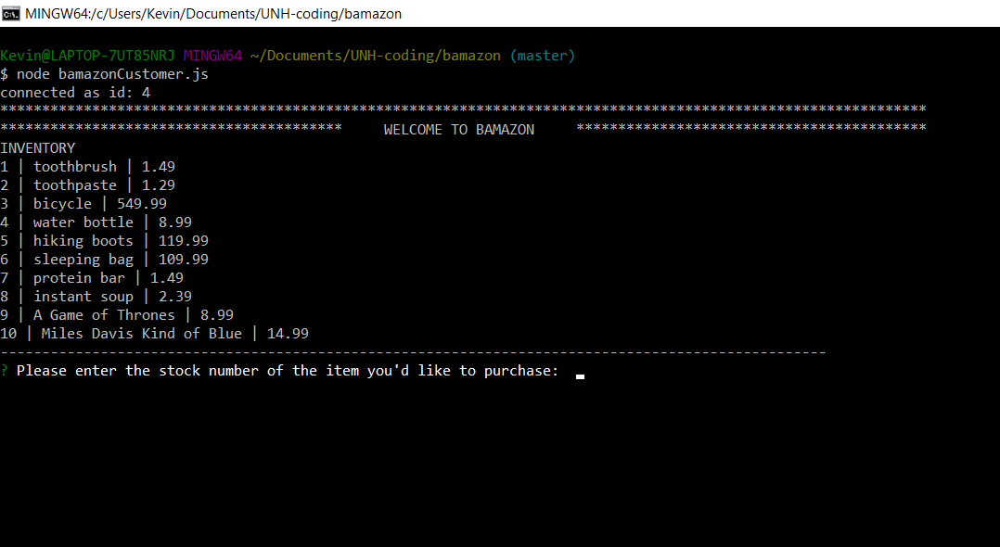

# Welcome to bamazon - a node.js eCommerce site

## Overview
**`bamazon`** is a Command Line Application (`CLI`) built to connect with a **`MySQL`** database. The database holds information about the products being offered through the storefront such as: `item numbers`, `product descriptions`, `prices`, and `current on-hand inventory`.

## How to use the application
1. At the CLI prompt type **`node bamazonCustomer.js`** and click on **`Enter`**

2. The bamazon storefront will load listing the items available for purchase with their corresponding `item numbers` and `prices`.  Peruse the list to determine what you'd like to purchase.

3. Once you have made your selection, enter the `item number` where you are prompted. Click on **`Enter`**.
4. Next, you will be prompted to enter the quantity of the item you wish to purchase. Enter the amount and click on **`Enter`**.
	* If there is not an ample supply in the on-hand inventory, **`bamazon`** will send you a message letting you know that it cannot fulfill your order.
5. **`bamazon`** will tally up your order by multiplying the item's `price` and the quanity you indicated. A message will appear indicating the summary of your order and the total amount due. The application will then end with an appropriate sign-off message.